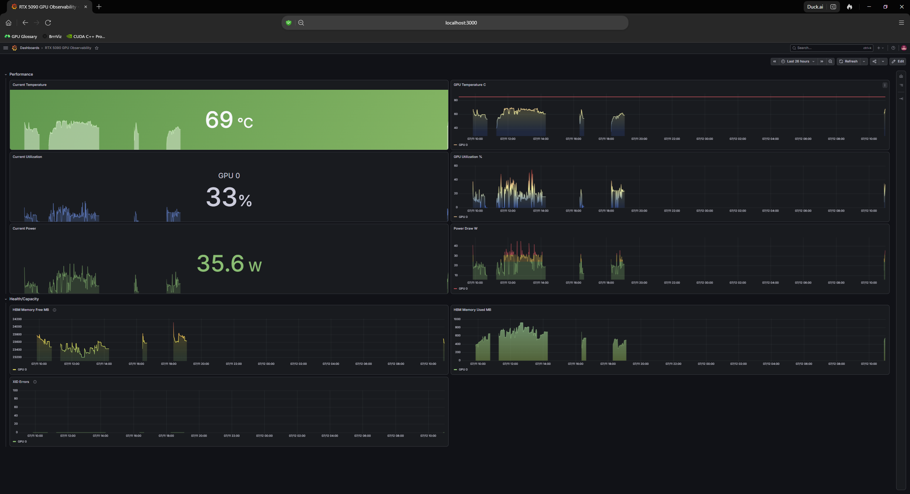
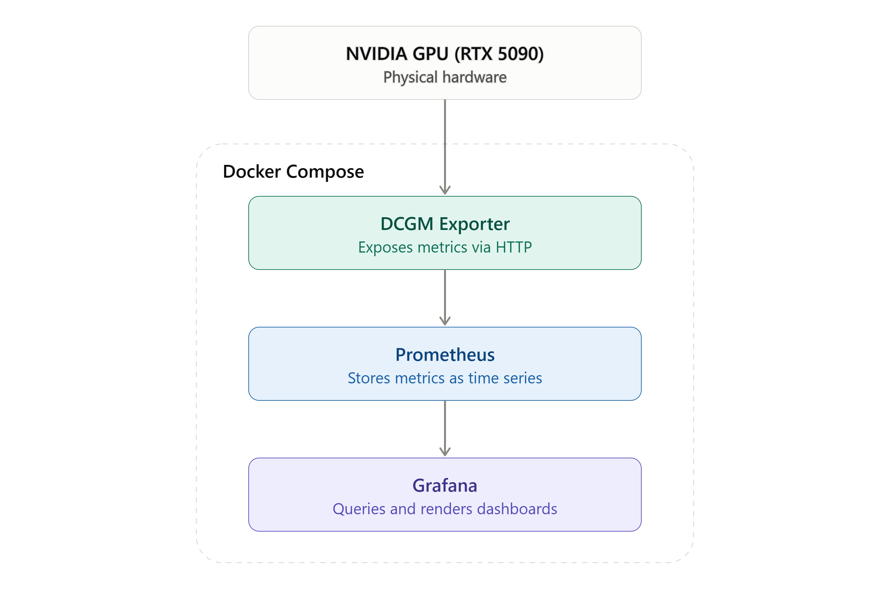

# rtx5090-gpu-observability
<h1 align="center">

</h1> 

### RTX 5090 GPU Observability Stack

A containerized GPU telemetry pipeline built on the same monitoring primitives that NVIDIA uses at datacenter scale. DCGM, Prometheus, and Grafana were deployed against my single workstation GPU to demonstrate real-time observability, threshold-based health monitoring, and correlated performance analysis under active compute load. Gaps in the timeline reflect periods when the Docker stack was stopped between sessions. Prometheus only records data while actively scraping.



## Why this exists

GPU utilization, thermal behavior, power draw, and memory pressure are usually invisible unless something breaks. This project makes them visible and queryable in real time, because it's the same category of tooling that underlies fleet-scale GPU health monitoring in HPC and datacenter environments, scoped down to a single-node deployment.

My goal wasn't just to plot numbers. I wanted a stack that:
- Correlates compute load with hardware response (utilization, temperature, power draw, observed together, not in isolation)
- Surfaces health signals proactively (thermal thresholds, XID fault detection) instead of requiring someone to go looking for problems
- Runs identically on any machine with an NVIDIA GPU, via Docker, with zero manual configuration beyond `docker-compose up`

## Architecture



```
NVIDIA GPU (RTX 5090)
       │
       ▼
DCGM Exporter          — reads live metrics via NVIDIA's DCGM library, exposes them as an HTTP endpoint
       │  (scraped every N seconds)
       ▼
Prometheus              — scrapes, timestamps, and stores metrics as a queryable time series
       │  (PromQL)
       ▼
Grafana                 — queries Prometheus, renders dashboards, evaluates thresholds
```

Why this layering matters: DCGM Exporter is stateless, so it reports the instantaneous value of a metric and nothing else. Prometheus is what introduces history: on every scrape, it timestamps and persists the value, which is what lets Grafana render a trend line instead of a single flat number. Grafana holds none of the data itself, it's a pure query-and-render layer on top of Prometheus.

The entire stack is defined in `docker-compose.yml`, making the deployment portable across any laptop or workstation with an NVIDIA GPU and driver support. No environment-specific setup required.

## Tech stack

| Component | Role |
|---|---|
| **NVIDIA DCGM** | Datacenter GPU Manager, the same telemetry/health/diagnostics library NVIDIA uses for cluster-scale GPU fleet management, running here against a single GPU |
| **DCGM Exporter** | Exposes live DCGM metrics as a Prometheus-scrapable HTTP endpoint |
| **Prometheus** | Time-series database; scrapes, stores, and queries all historical metric data |
| **Grafana** | Visualization and dashboarding layer; threshold evaluation and alerting UI |
| **Docker Compose** | Orchestrates the full stack as a single reproducible deployment |

**Hardware:** ASUS ROG Zephyrus G16 – NVIDIA GeForce RTX 5090

## Dashboard layout

The dashboard is split into two functional groupings instead of a flat list of panels:

### Performance
Real-time compute behavior: what the GPU is doing right now, and how that's trended over the session.

| Metric | Panel type | Notes |
|---|---|---|
| GPU Utilization | Stat + time series | Live % alongside historical trend |
| GPU Temperature | Stat + time series | Threshold line at 85°C (thermal safety ceiling) |
| Power Draw | Stat + time series | Watts, live + historical |

### Health / Capacity
Structural GPU state: memory pressure and fault status.

| Metric | Panel type | Notes |
|---|---|---|
| HBM Memory Used | Time series | MB in active use |
| HBM Memory Free | Time series | MB available |
| XID Errors | Time series | Hardware fault indicator (see below) |

**Reading a flat line at 0 on XID Errors:** XID errors are NVIDIA's hardware/driver-level fault codes (ECC errors, XID resets, etc). A flat line at zero isn't a broken panel, it's the intended healthy state. This panel exists to catch anomalies, not to display constant activity. Its value is in what it would show if something went wrong.

## Observing load in practice

The dashboard was captured while running multiple CUDA kernel workloads alongside 4K video playback, producing visible, correlated spikes across utilization, temperature, and power draw. That's the pipeline capturing real hardware response to compute load, not static or idle data.

## Getting started

```bash
git clone https://github.com/Dre1896/rtx5090-gpu-observability.git
cd rtx5090-gpu-observability
docker-compose up -d
```

Once running:
- Prometheus: `http://localhost:9090`
- Grafana: `http://localhost:3000`
- DCGM Exporter metrics endpoint: `http://localhost:9400/metrics`

The dashboard isn't auto-provisioned yet, so import it manually the first time:
1. Open Grafana at `http://localhost:3000`
2. Add Prometheus as a data source (URL: `http://prometheus:9090`)
3. Go to **Dashboards → New → Import**
4. Upload `grafana/grafana-dashboard.json` from this repo

**Requirements:** NVIDIA GPU with current drivers, NVIDIA Container Toolkit, Docker + Docker Compose.

## Design notes

- **Thresholds over raw plotting:** The 85°C threshold isn't cosmetic, it encodes an actual thermal safety boundary, so the dashboard tells you when to be concerned, not just what the number is.
- **Stat + time series pairing:** Each core performance metric gets both an at-a-glance current value and a trend, because "what is it right now" and "how did it get here" are different questions that both matter operationally.
- **Portability by design:** The Docker Compose architecture means this isn't a one-off script tied to one machine. It's a deployable observability pattern that generalizes to any NVIDIA GPU environment, single-node or fleet.

## Future improvements

- Auto-provision the dashboard on startup via `grafana/provisioning/`, so no manual import step is needed
- Grafana annotations marking workload start/stop events for precise event correlation
- Alertmanager integration for threshold-breach notifications
- Multi-GPU support for validating fleet-scale behavior beyond a single node

## License
MIT, see LICENSE.
