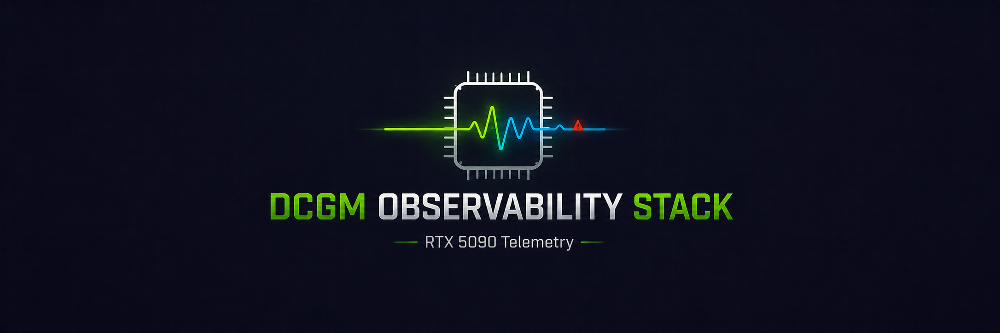

# rtx5090-gpu-observability
<h1 align="center">

</h1> 

### RTX 5090 GPU Observability Stack

A containerized GPU telemetry pipeline built on the same monitoring primitives that NVIDIA uses at datacenter scale. DCGM, Prometheus, and Grafana were deployed against my single workstation GPU to demonstrate real-time observability, threshold-based health monitoring, and correlated performance analysis under active compute load. Gaps in the timeline reflect periods when the Docker stack was stopped between sessions. Prometheus only records data while actively scraping.

ADD IMAGE

## Why This Exists

GPU utilization, thermal behavior, power draw, and memory pressure are usually invisible unless something breaks. This project makes them visible and queryable in real time because this is the same category of tooling that underflies fleet-scale GPU health monitoring in HPC and datacenter environments, scoped down to a single-node deployment.

My goal wasn’t just to plot numbers. It was to build a stack that:
Correlates compute load with hardware response (utilization → temperature → power draw, observed together, not in isolation)
Surfaces health signals proactively (thermal thresholds, XID fault detection) rather than requiring someone to go looking for problems
Runs identically on any machine with an NVIDIA GPU, via Docker, with zero manual configuration beyond docker-compose up

## Architecture 

ADD IMAGE

NVIDIA GPU (RTX 5090)
       │
       ▼
DCGM Exporter          — reads live metrics via NVIDIA's DCGM library, exposes them as an HTTP endpoint
       │  (scraped every N seconds)
       ▼
Prometheus              — scrapes, timestamps, and stores metrics as a queryable time series
       │  (PromQL)
       ▼
Grafana                 — queries Prometheus, renders dashboards, evaluates thresholds

Why this layering matters: DCGM Exporter is stateless so it reports the instantaneous value of a metric and nothing else. Prometheus is what introduces history: on every scrape, it timestamps and persists the value, which is what allows Grafana to render a trend line instead of a single flat number. Grafana itself holds none of the data, it’s a pure query-and-render layer on top of Prometheus.

The entire stack is defined in docker-compose.yml, making the deployment portable across any laptop or workstation with an NVIDIA GPU and driver support so there is no environment specific setup required. 

## Tech Stack
Component
Role
NVIDIA DCGM
Datacenter GPU Manager — the same telemetry/health/diagnostics library NVIDIA uses for cluster-scale GPU fleet management, running here against a single GPU
DCGM Exporter
Exposes live DCGM metrics as a Prometheus-scrapable HTTP endpoint
Prometheus
Time-series database; scrapes, stores, and queries all historical metric data
Grafana
Visualization and dashboarding layer; threshold evaluation and alerting UI
Docker Compose
Orchestrates the full stack as a single reproducible deployment

Hardware: ASUS ROG Zephyrus G16 – NVIDIA GeForce RTX 5090

### Dashboard Layout: 
The dashboard is organized into two functional groupings rather than a flat list of panels:

Performance
Real-time compute behavior is what the GPU is doing right now, and how that’s trended over the session. 

Metric
Panel Type
Notes
GPU Utilization
Stat + Time series
Live % alongside historical trend
GPU Temperature
Stat + Time series
Threshold line at 85°C (thermal safety ceiling)
Power Draw
Stat + Time series
Watts, live + historical

Health / Capacity
Structural GPU state relies on memory pressure and fault status.
Metric
Panel Type
Notes
HBM Memory Used
Time series
MB in active use
HBM Memory Free
Time series
MB available
XID Errors
Time series
Hardware fault indicator (see below)

XID Errors read a flat line a 0: XID errors are NVIDIA’s hardware/driver-level fault codes (ECC errors, XID reset, etc.). A flat line at zero is not a broken panel, it is actually the intended healthy state. This panel exists to catch anomalies, not to display constant activity; its value is in what it would show if something went wrong.

Observing Load in Practice

ADD IMAGE

The dashboard was captured while running multiple CUDA kernel workloads alongside 4K video playback, producing visible, correlated spikes across utilization, temperature, and power draw demonstrating that the pipeline captures real hardware response to compute load, not static/idle data. 

Getting Started

bash
git clone https://github.com/Dre1896/rtx5090-gpu-observability.git
cd rtx5090-gpu-observability
docker-compose up -d

Once running:
Prometheus: http://localhost:9090
Grafana: http://localhost:3000
DCGM Exporter metrics endpoint: http://localhost:9400/metrics

The dashboard (grafana/dashboards/rtx5090-gpu-observability.json) is auto-provisioned on startup via grafana/provisioning/ so no manual dashboard import is really needed.

Requirements: NVIDIA GPU with current drivers, NVIDIA Container Toolkit, Docker + Docker Compose.

Design Notes
Thresholds over raw plotting: The 85°C threshold isn’t cosmetic, it encodes ana actual thermal safety boundary, so the dashboard tells you when to be concerned, not just what the number is.
Stat + time series pairing: Each core performance metric gets both an at-a-glance current value and a trend, because “what is it right now” and “how did it get here” are different questions that both matter operationally. 
Portability by design: The Docker Compose architecture means this isn’t a one-off script tied to one machine. It’s a deployable observability pattern that generalizes to any NVIDIA GPU environment, single-node or fleet

Future Improvements
Grafana annotations marking workload start/stop events for precise event correlation
Alertmanager integration for threshold-breach notifications 
Multi-GPU support for validating fleet-scale behavior beyond a single node

License
MIT – see LICENSE.
